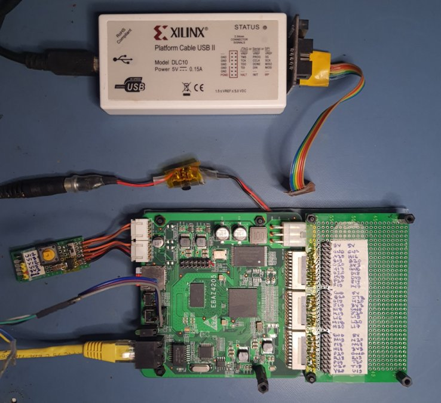

<h1> Petalinux 2022.2 for EBAZ4205 board with Zynq 7010 </h1>

<p align="center">

<p>

**Environment** 
* Ubuntu 22.04LTS on amdx64 machine
* [Xilinx Unified Installer 2022.2 SFD](https://www.xilinx.com/support/download/index.html/content/xilinx/en/downloadNav/vivado-design-tools.html)
   * Select Vitis - this will install Vitis and Vivado Design suite
   * Run again and select Petalinux (install in the same directory)
   * Install updates 
   * Download Petalinux sstate-cache and pre-mirror archives to avoid repetitive downloading from network during build process
   * [Install cable drivers](https://support.xilinx.com/s/article/66440?language=en_US)


**Credits**
   
* [Petalinux 101 - Getting Started Quickly - Youtube](https://www.youtube.com/watch?v=k03r2Ud42jY)
* [Embedded Linux + FPGA/SoC (Zynq Part 5) - Phil's Lab - Youtube](https://www.youtube.com/watch?v=OfozFBfvWeY)
* [Zynq + Vivado + Vitis tutorials - Youtube](https://www.youtube.com/watch?v=X4z1U8dJCTc&list=PLXHMvqUANAFOviU0J8HSp0E91lLJInzX1&index=2)
* [EBAZ4205 Reference Design](https://github.com/nightseas/ebit_z7010)
* [EBAZ4205 petalinux, documentation links](https://github.com/KeitetsuWorks/EBAZ4205)
* [Local sstate-cache and download mirrors](https://www.xilinx.com/content/dam/xilinx/support/download/plnx/sstate_rel_2022.2_README.txt)
* https://support.xilinx.com/s/question/0D52E00006hpRM7SAM/cant-boot-petalinux-from-sd?language=en_US
* https://support.xilinx.com/s/question/0D52E00006hpPmhSAE/petalinux-20192-rootfs-in-sd?language=en_US


<h1> EBAZ4205 hardware modifications </h1>

The board has a Zynq 7010 (CLG400 package), 256MByte DDR3 RAM, 128MByte Nand Flash, 100Mbps Ethernet. I made the following changes to my board :

1. Installed microSD socket (shipped with the board).
1. Installed 25MHz crystal Y3 and 22pF caps for Ethernet PHY. R1485 not populated.
2. Installed 25MHz crystal oscillator X5 and associated passive R,C,L components for PL clock, connected to Zynq 7010 pin N18.
3. Installed SPDT switch for selecting boot via SD card or Nand Flash.
For SD boot, Zynq pin U12-IO0_0 is connected to GND via R2584. For SD boot, pin U12-IO0_0 is connected to VCC via R2577. When SD boot is selected and the SD card is not detected on power-on, falls back to JTAG.
4. Installed push button switch S3 plus associated R, C components. 
5. Installed diode SS810 (D24) to supply power from the ATX connector. The board documentation shows 12V, but that was required for cooling fans in the original bit-mining application. I use a standard 5V 2A adapter to supply power.

<h1> Create hardware platform using Vivado </h1>

Regenerate the Vivado 2022.2 project using the tcl script provided in the folder `/hw`.

Start Vivado, then in the TCL console at the bottom, navigate to the directory
containing the script 
```
cd <full path to script directory>
source ./ebit_7010_proj_gen.tcl
```

Once the project has been regenerated, click on `Generate Bitstream`. When that is complete, run `File->Export->Export Hardware`. Select `Include bitstream`. This will finally generate a Vivado hardware description file  `ebit_7010_top_wrapper.xsa`.

<h1> Create project using Vivado generated hardware description file (.xsa)</h1>

Set environment variables for Petalinux paths. Make sure to set the Petalinux tools path correctly in this script, for your installation.

```
$ source ./petalinux_env.sh
```

```
$ petalinux-create --type project --template zynq --name petalinux_sd

$ cd petalinux_sd
```

Specify the exported hardware description file from the Vivado project

```
$ petalinux-config  --get-hw-description=<full path to>/ebit_z7010_top_wrapper.xsa
```

In the pop-up menuconfig dialog :
 		
* Check hardware components (DDR, Enet, UART, SDIO) are present

* Image Packaging Configuration
 	* For SD boot, change Root filesystem type from `RAM initrd` to `ext4 (sd/eMMC/SATA/USB)` 
 	* Disable `Copy final images to tftpboot`
 
* Yocto settings :    Use pre-downloaded archives during the build process instead of downloading from network
   * change sstate archive from network site `http://xxx` to local directory `file:///home/<path to downloaded archive>/arm/`
 		
   * change pre-mirror url from network site `http://xxx` to local directory `file:///home/<path to downloaded archive>/downloads/`
		
   * Disable Network downloads
   
	* For SD boot : Use EXT4 rootfs during boot

	*Method A: PetaLinux config*

	Disable `DTG settings -> Kernel Bootargs -> generate boot args automatically`
   
   Update User Set Kernel Bootargs to 
   ```
   earlycon console=ttyPS0,115200 clk_ignore_unused root=/dev/mmcblk0p2 rw rootwait cma=8M 
   ```

	*Method B: device tree*

	Update in system-user.dtsi
	Add chosen node in root in addition to the previous changes to this file.
   ```
   / {
      chosen {
         bootargs = "earlycon console=ttyPS0,115200 clk_ignore_unused root=/dev/mmcblk0p2 rw rootwait cma=512M";
      };
   };
   ```


<h1> Configure the kernel </h1>

```
$ petalinux-config -c kernel
```

Nothing to change in menuconfig dialog, exit and save

<h1> Configure u-boot </h1>

```
$ petalinux-config -c u-boot
```

**Boot Media**

For SD boot, enable booting from SD Card, disable other options. 

For initrd RAM boot, leave all unchecked.


<h1> Configure Root file system </h1>

```
$ petalinux-config -c rootfs
```

User packages : add gpio-demo and peekpoke
	 	
<h1> Build </h1>

```
$ petalinux-build
```

<h1> JTAG download and boot using initrd RAM </h1>

**Verify JTAG adapter connection to Zynq**

1. Open Vivado hardware project
2. Open Hardware Manager
3. Open target. This should detect the JTAG adapter. I use a Xilinx Platform Cable USB II DLC10.
4. Connect and verify that you can see the Zynq target. 
5. Disconnect.

**JTAG boot**

```
$ petalinux-boot --jtag --kernel
```

This will download the bitstream, first-stage bootloader, device tree, u-boot, kernel image and root file system to DDR memory, and then start the boot process.

I use minicom terminal @ 115200baud to monitor the download and boot process. 

```
system.bit
zynq_fsbl.elf
system.dtb at 0x00100000
u-boot.elf
uImage at 0x00200000
rootfs.cpio.gz.u-boot at 0x04000000
boot.scr at 0x03000000

...
```

After several minutes, you should finally see the login prompt. The user is
`petalinux` 

```
login : petalinux
set the password
```

<h1>Boot from SD card </h1>

<h2> Create the BOOT.BIN file </h2>


```
$ cd images/linux
$ petalinux-package --boot --fsbl zynq_fsbl.elf --fpga system.bit --u-boot u-boot.elf -o BOOT.BIN --force
```

This is the output 

```
[INFO] Sourcing buildtools
INFO: Getting system flash information...
INFO: File in BOOT BIN: "/home/nair/fpga/ebit/ebaz4205/petalinux_ram/images/linux/zynq_fsbl.elf"
INFO: File in BOOT BIN: "/home/nair/fpga/ebit/ebaz4205/petalinux_ram/images/linux/system.bit"
INFO: File in BOOT BIN: "/home/nair/fpga/ebit/ebaz4205/petalinux_ram/images/linux/u-boot.elf"
INFO: File in BOOT BIN: "/home/nair/fpga/ebit/ebaz4205/petalinux_ram/images/linux/system.dtb"
INFO: Generating zynq binary package BOOT.BIN...

****** Xilinx Bootgen v2022.2
  **** Build date : Sep 26 2022-06:24:42
    ** Copyright 1986-2022 Xilinx, Inc. All Rights Reserved.

[WARNING]: Partition zynq_fsbl.elf.0 range is overlapped with partition system.bit.0 memory range
[WARNING]: Partition system.bit.0 range is overlapped with partition system.dtb.0 memory range

[INFO]   : Bootimage generated successfully

INFO: Binary is ready.
```

The warning about overlap can be ignored, both files are being copied to the same memory partition, but are not actually overlapping in destination memory address ranges.

You can verify the layout of `BOOT.BIN` using the command

```
$ bootgen -arch zynq -read BOOT.BIN
```


<h2> Prepare SD card </h2>


<h3> Create boot and root file system partitions </h3>

On my system, the SD card shows up as `/dev/sdb`. I used a 32GB card, with 1GB allocated for the boot partition and the remainder for the root file system.

```
$ sudo fdisk /dev/sdb
```
*Create two partitions*

	partition 1, primary, default offset, size +1024MB, FAT32 (0x0b), bootable
	partition 2, primary, default offset, default size, Linux (0x83)

*Format the partitions*

```
$ sudo mkfs.msdos -n BOOT /dev/sdb1
$ sudo mkfs.ext4 -L rootfs /dev/sdb2
```

*Mount the fat32 partition (in my case it is mounted at /media/nair/BOOT) and copy the required boot files*

```
$ cp BOOT.BIN /media/nair/BOOT
$ cp boot.scr /media/nair/BOOT
$ cp image.ub /media/nair/BOOT 
$ sync
```

**Write root file system**

*Method 1 : using build output rootfs.ext4*

If the ext4 partition is mounted, unmount it before dd command

```
$ sudo umount /dev/sdb2
$ sudo dd if=rootfs.ext4 of=/dev/sdb2
```
Resize the ext4 partition to the full space available (~31GB).
```
$ sudo resize2fs /dev/sdb2
$ sudo e2label /dev/sdb2 "rootfs"
```

Mount the partition again

*Method 2 : using rootfs.cpio build output*

```
$ sudo cp rootfs.cpio /media/nair/rootfs
$ cd /media/nair/rootfs
$ sudo pax -rvf rootfs.cpio
```

*Method 3 : using rootfs.tar.gz build output*

Ensure the root partition is mounted. In my case it is mounted at /media/nair/rootfs.

```
$ sudo tar xvzf rootfs.tar.gz -C /media/nair/rootfs
```

Set ownership and permissions

```
$ sudo chown root:root /media/nair/rootfs/
$ sudo chmod 755 /media/nair/rootfs/
```

Flush caches to SD

```
$ sync
```

Safely eject the card


<h2> Clean project before rebuilding </h2>

```
rm -rf components/plnx_workspace
petalinux-build -x distclean
petalinux-build -x mrproper --force
```

<h1> Archive petalinux project </h1>

*Method 1 : generate bsp*

```
$ petalinux-package --bsp -p ./petalinux_sd --hwsource ./vivado --output petalinux_sd_may12.bsp
```

*Method 2 : Clean and tar*

```
$ petalinux-build -x mrproper
$ cd ..
$ tar -czvf petalinux_sd_may12.tar.gz ./petalinux_sd
```

<h1> Re-create petalinux project from bsp file </h1>

```
$ petalinux-create -t project -s petalinux_sd_may12.bsp
```
